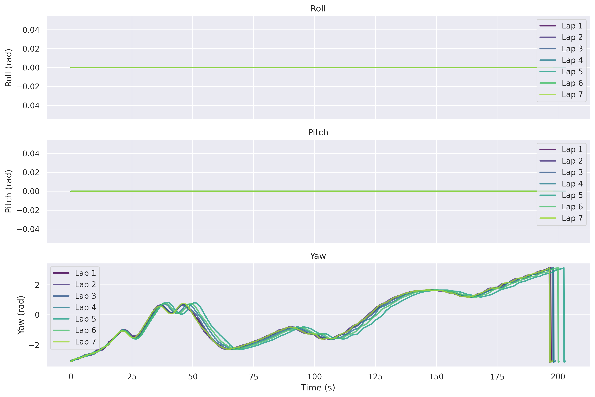
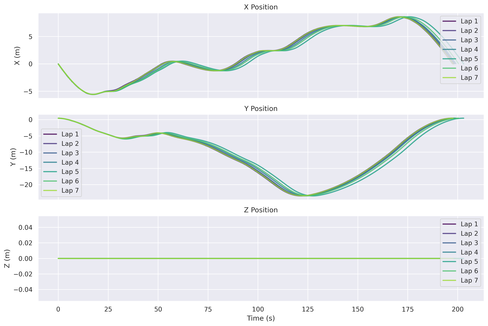
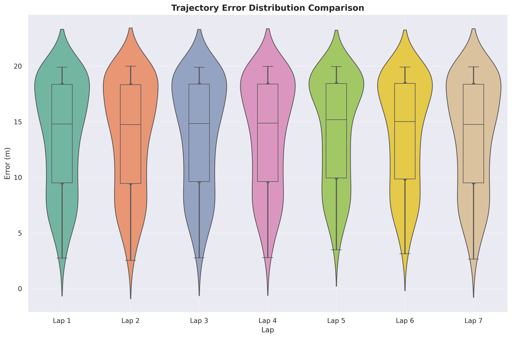
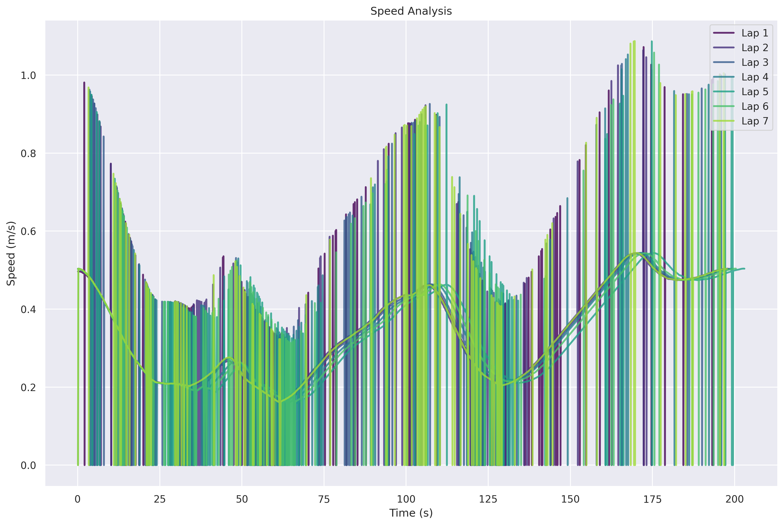
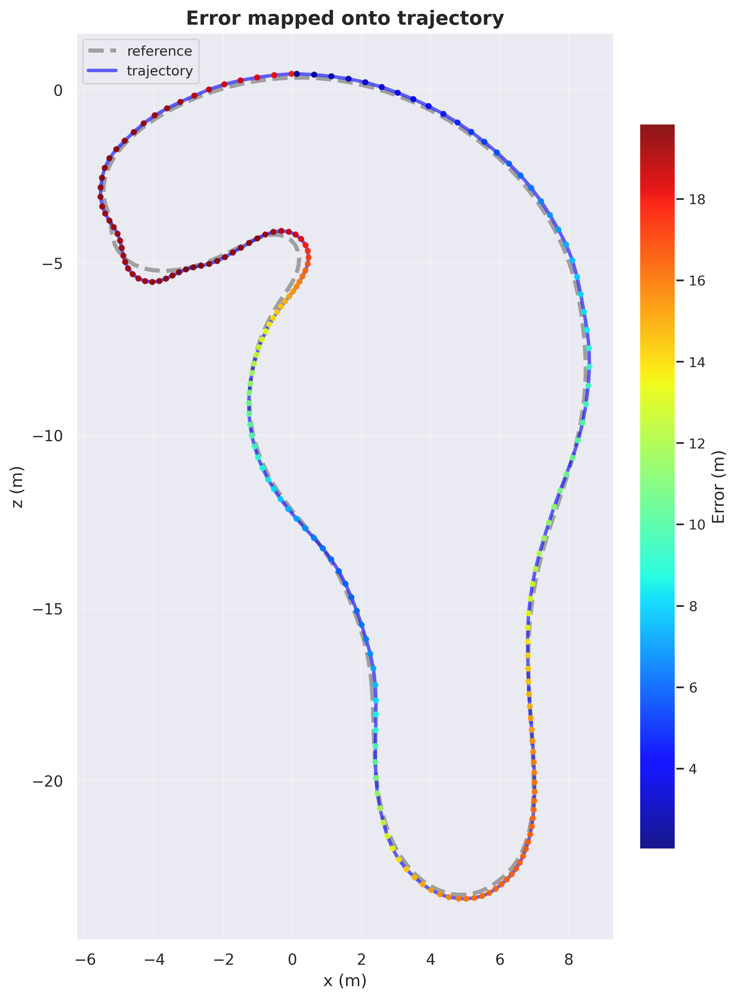
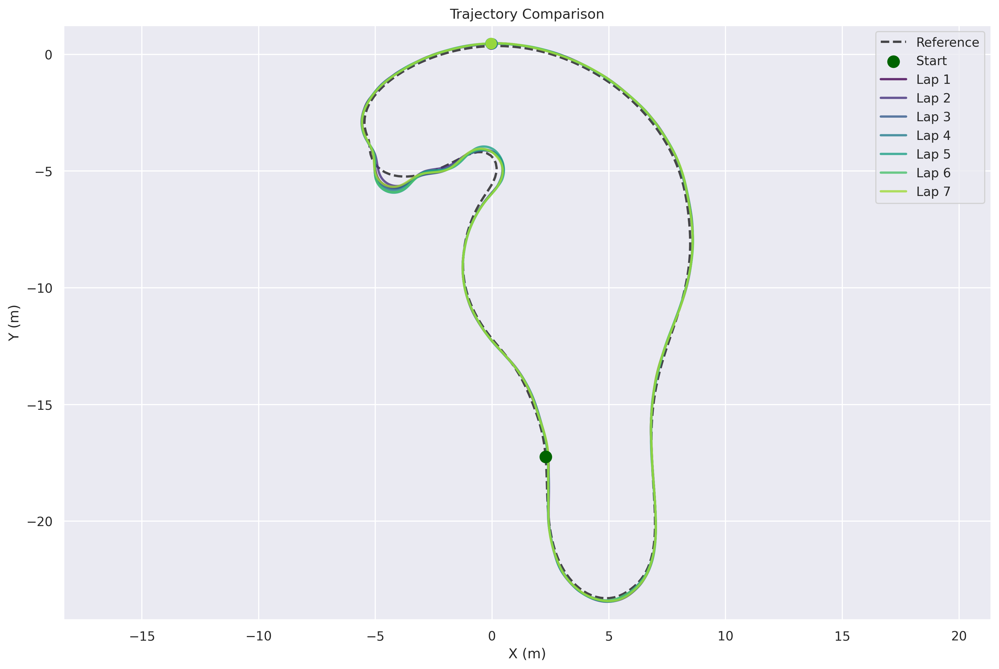

# Race Monitor: Advanced Performance Analysis Framework for Roboracer Autonomous Racing

<div align="center">

[](https://github.com/GIU-F1Tenth/race_monitor/actions)
[](https://docs.ros.org/en/humble/)
[](https://www.python.org/)
[](https://github.com/MichaelGrupp/evo)
[](LICENSE)

**A comprehensive ROS2-based framework for real-time performance monitoring, trajectory analysis, and controller evaluation in autonomous racing**

[Quick Start](#quick-start) • [Features](#features) • [Results](#example-results) • [Documentation](#documentation) • [Citation](#citation)

</div>

---

## Abstract

Race Monitor is a research-grade performance analysis framework designed for autonomous racing platforms. The system provides real-time lap timing, comprehensive trajectory evaluation using the EVO library, computational performance monitoring, and multi-format data export capabilities. Built on ROS2, Race Monitor enables systematic controller comparison, experimental reproducibility, and quantitative performance assessment essential for autonomous racing research.

## Overview

This framework addresses the critical need for standardized performance evaluation in autonomous racing research. Race Monitor provides researchers and engineers with tools to:

- Conduct reproducible experiments with consistent lap detection and timing
- Evaluate trajectory quality using industry-standard metrics (APE, RPE)
- Monitor computational performance in real-time
- Export data in multiple formats for cross-platform analysis
- Generate publication-ready visualizations automatically

### Key Capabilities

- **Real-time Race Monitoring**: Configurable lap detection with geometric intersection-based triggering
- **Trajectory Analysis**: 40+ performance metrics per lap using the EVO trajectory evaluation library
- **Computational Monitoring**: CPU, memory, and latency tracking for performance optimization
- **Multi-format Export**: Data export in CSV, JSON, MATLAB (.mat), and Pickle formats
- **Automated Visualization**: Publication-ready graphs in PNG and PDF formats
- **Research-Ready Architecture**: Structured data organization ensuring experimental reproducibility

---

## Quick Start

### Installation

```bash
# Clone repository with submodules
cd ~/ros2_ws/src
git clone --recursive https://github.com/GIU-F1Tenth/race_monitor.git

# Install EVO library
cd race_monitor/evo
pip install -e .

# Install Required dependencies
pip install -c constraints.txt -r requirements.txt

# Build package
cd ~/ros2_ws
colcon build --packages-select race_monitor
source install/setup.bash
```

For detailed installation instructions, including system requirements and troubleshooting, see [docs/INSTALLATION.md](docs/INSTALLATION.md).

### Basic Usage

```bash
# 1. Configure start/finish line coordinates
nano config/race_monitor.yaml

# 2. Launch Race Monitor node
ros2 launch race_monitor race_monitor.launch.py

# 3. Launch your controller node
ros2 launch your_controller your_controller.launch.py

# 4. Monitor race progress via ROS2 topics
ros2 topic echo /race_monitor/lap_time
```

Comprehensive usage examples and workflows are available in [docs/USAGE.md](docs/USAGE.md).

---

## System Architecture

Race Monitor implements a modular architecture designed for extensibility and research reproducibility:

```
┌─────────────────────────────────────────────────────────────┐
│                    ROS2 Node: Race Monitor                  │
├─────────────────────────────────────────────────────────────┤
│  ┌───────────────┐  ┌────────────────┐  ┌────────────────┐  │
│  │  Lap Timing   │  │   Trajectory   │  │  Performance   │  │
│  │   Monitor     │  │    Analyzer    │  │    Monitor     │  │
│  └───────┬───────┘  └────────┬───────┘  └────────┬───────┘  │
│          │                   │                    │         │
│  ┌───────▼──────────────────▼────────────────────▼───────┐  │
│  │            Race Evaluator (Core Engine)               │  │
│  └───────────────────────────┬───────────────────────────┘  │
│  ┌──────────────┬────────────▼─────────────┬─────────────┐  │
│  │ Visualization│  Data Manager            │  Metadata   │  │
│  │   Engine     │  (Export & Organization) │   Manager   │  │
│  └──────────────┴──────────────────────────┴─────────────┘  │
└─────────────────────────────────────────────────────────────┘
```

### Core Components

1. **Lap Timing Monitor**: Geometric line intersection detection for lap counting and timing
2. **Trajectory Analyzer**: Real-time trajectory recording and analysis with 40+ metrics
3. **Performance Monitor**: Control loop latency measurement and resource monitoring
4. **Race Evaluator**: Central coordination, data integration, and multi-lap aggregation
5. **Data Manager**: Multi-format export with hierarchical data organization
6. **Visualization Engine**: Automated generation of publication-ready graphs
7. **EVO Integration**: Trajectory format conversion and APE/RPE analysis

---

## Features

### Race Management

- Real-time lap detection with configurable start/finish line definition
- Multi-lap session support with automatic lap counting
- Debouncing logic to prevent false lap detection triggers
- Multiple race ending modes: lap-based, crash detection, and manual
- Live race status monitoring via ROS2 topics

### Trajectory Analysis

- Integration with EVO (Evolution of Odometry) trajectory evaluation library
- Comprehensive metrics suite: 40+ performance indicators per lap
- Multi-format trajectory export: TUM, KITTI, EuRoC formats
- Reference trajectory comparison with ground truth alignment
- Statistical analysis and lap-to-lap consistency evaluation
- Path geometry analysis: length, efficiency, curvature
- Velocity and acceleration profiling with jerk analysis

### Performance Monitoring

- Real-time control loop latency measurement
- System resource utilization tracking (CPU, memory)
- Configurable performance thresholds with alerting
- Computational efficiency scoring
- Multi-topic monitoring support

### Data Management and Export

- Multi-format data export: CSV, JSON, MATLAB (.mat), Pickle
- Hierarchical organization by controller and experiment
- Optional Savitzky-Golay trajectory filtering for noise reduction
- Automated visualization generation in PNG and PDF formats
- Complete metadata tracking for experimental reproducibility
- Experiment versioning and configuration logging

---

## Example Results

Representative performance data from an LQR controller evaluation experiment:

### Performance Summary

| Metric | Value |
|--------|-------|
| Overall Grade | B+ (75.0/100) |
| Best Lap Time | 19.53 s |
| Average Lap Time | 19.75 s |
| Lap Time Consistency | 99.22% |
| Total Laps Completed | 7 |
| Total Race Duration | 138.23 s |
| Average Speed | 3.40 m/s |

### Sample Visualizations

The framework automatically generates comprehensive visualizations including trajectory plots, speed profiles, error analysis, and 3D visualizations. Sample outputs are available in `resource/sample_output_data/graphs/`.

<div align="center">

| Roll-Pitch-Yaw Analysis | XYZ Position Analysis |
|:-----------------------:|:---------------------:|
|  |  |

| Trajectory Error Distribution | Velocity Profile |
|:---------------------:|:----------------:|
||  |


| Error-Mapped Trajectory | Trajectory Comparison |
|:-----------------------:|:-----------------------------:|
|  |   |


</div>

Detailed results analysis and interpretation are available in [docs/RESULTS.md](docs/RESULTS.md).

---

## System Architecture

```
┌─────────────────────────────────────────────────────────────┐
│                    ROS2 Node: Race Monitor                  │
├─────────────────────────────────────────────────────────────┤
│  ┌───────────────┐  ┌────────────────┐  ┌────────────────┐  │
│  │  Lap Timing   │  │   Trajectory   │  │  Performance   │  │
│  │   Monitor     │  │    Analyzer    │  │    Monitor     │  │
│  └───────┬───────┘  └────────┬───────┘  └────────┬───────┘  │
│          │                   │                   │          │
│  ┌───────▼───────────────────▼───────────────────▼───────┐  │
│  │            Race Evaluator (Core Engine)               │  │
│  └───────────────────────────┬───────────────────────────┘  │
│  ┌──────────────┬────────────▼─────────────┬─────────────┐  │
│  │ Visualization│  Data Manager            │  Metadata   │  │
│  │   Engine     │  (Export & Organization) │   Manager   │  │
│  └──────────────┴──────────────────────────┴─────────────┘  │
└─────────────────────────────────────────────────────────────┘
```

---

## Documentation

### Getting Started
- [Installation Guide](docs/INSTALLATION.md) - Complete installation instructions and system requirements
- [Usage Guide](docs/USAGE.md) - Basic to advanced usage examples and workflows
- [Configuration Guide](docs/CONFIGURATION.md) - Comprehensive parameter reference

### Advanced Topics
- [EVO Integration](docs/EVO_INTEGRATION.md) - Trajectory evaluation using the EVO library
- [Results & Analysis](docs/RESULTS.md) - Example results with detailed interpretation
- [API Reference](docs/API_REFERENCE.md) - ROS2 topics, services, and parameters
- [Troubleshooting](docs/TROUBLESHOOTING.md) - Common issues and solutions

### Additional Resources
- [Data Structure](data/README.md) - Output organization and data formats
- [Reference Trajectories](ref_trajectory/README.md) - Reference trajectory setup guide
- [Testing Guide](test/README.md) - Testing procedures and guidelines
- [Parameter Audit Report](PARAMETER_AUDIT_REPORT.md) - Complete parameter documentation

---

## ROS2 Interface

### Published Topics

| Topic | Type | Description |
|-------|------|-------------|
| `/race_monitor/lap_count` | `std_msgs/Int32` | Current lap number |
| `/race_monitor/lap_time` | `std_msgs/Float32` | Last completed lap time (seconds) |
| `/race_monitor/race_running` | `std_msgs/Bool` | Race active status indicator |
| `/race_monitor/race_status` | `std_msgs/String` | Complete race status (JSON format) |
| `/race_monitor/total_distance` | `std_msgs/Float32` | Total distance traveled (meters) |
| `/race_monitor/current_trajectory` | `nav_msgs/Path` | Current lap trajectory path |
| `/race_monitor/trajectory_metrics` | `std_msgs/String` | EVO-based trajectory metrics (JSON) |

Complete API documentation is available in [docs/API_REFERENCE.md](docs/API_REFERENCE.md).

### Subscribed Topics

| Topic | Type | Required |
|-------|------|----------|
| `/car_state/odom` | `nav_msgs/Odometry` | Yes |
| `/clicked_point` | `geometry_msgs/PointStamped` | No (interactive setup) |

---

## Output Data Structure

```
data/
└── {controller_name}/
    └── exp_YYYYMMDD_HHMMSS/
        ├── experiment_metadata.txt
        ├── trajectories/
        │   ├── csv/
        │   ├── json/
        │   ├── tum/     
        │   ├── pickle/
        │   └── mat/
        ├── results/
        │   ├── csv/
        │   │   ├── race_results.csv
        │   │   ├── race_summary.csv
        │   │   └── race_evaluation.csv
        │   └── json/
        └── graphs/
            ├── png/
            └── pdf/
```

All data is organized hierarchically for easy analysis and comparison. Sample data available in `resource/sample_output_data/`.

---

## Citation

If you use Race Monitor in your research, please cite:

```bibtex
@software{race_monitor2025,
  author       = {Abdelazim, Mohammed},
  title        = {Race Monitor: Advanced Performance Analysis Framework for Autonomous Racing},
  year         = {2025},
  publisher    = {GitHub},
  organization = {GIU Roboracer Team},
  howpublished = {\url{https://github.com/GIU-F1Tenth/race_monitor}},
  version      = {1.0.0}
}
```

### EVO Citation

Race Monitor uses the EVO library for trajectory evaluation:

```bibtex
@software{grupp2017evo,
  author       = {Grupp, Michael},
  title        = {evo: Python package for the evaluation of odometry and SLAM},
  year         = {2017},
  howpublished = {\url{https://github.com/MichaelGrupp/evo}}
}
```

---

## Contributing

We welcome contributions to improve Race Monitor:

- **Feature Requests**: Submit via GitHub Issues with the "enhancement" label
- **Documentation**: Improvements to guides and examples are always appreciated
- **Testing**: Test coverage and integration tests
- **Bug Reports**: Detailed reports help us improve stability
- **Localizations**: Translations and regional adaptations

Please see our contribution guidelines before submitting pull requests.

## Contact

- **Email**: @Mohammed-Azab - mohamed@azab.io
- **GitHub**: [github.com/GIU-F1Tenth/race_monitor](https://github.com/GIU-F1Tenth/race_monitor)
- **Package**: ROS2 race_monitor
- **Issues**: [GitHub Issue Tracker](https://github.com/GIU-F1Tenth/race_monitor/issues)
- **Discussions**: [GitHub Discussions](https://github.com/GIU-F1Tenth/race_monitor/discussions)
- **Documentation**: [docs/README.md](docs/README.md)

---

Built for the autonomous racing community with precision and reliability.
