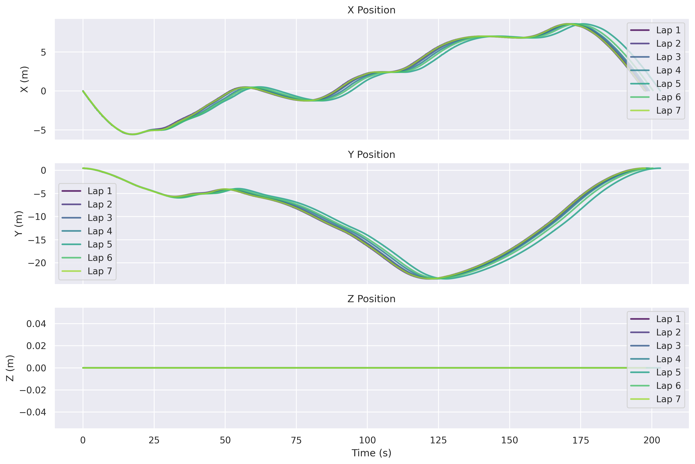
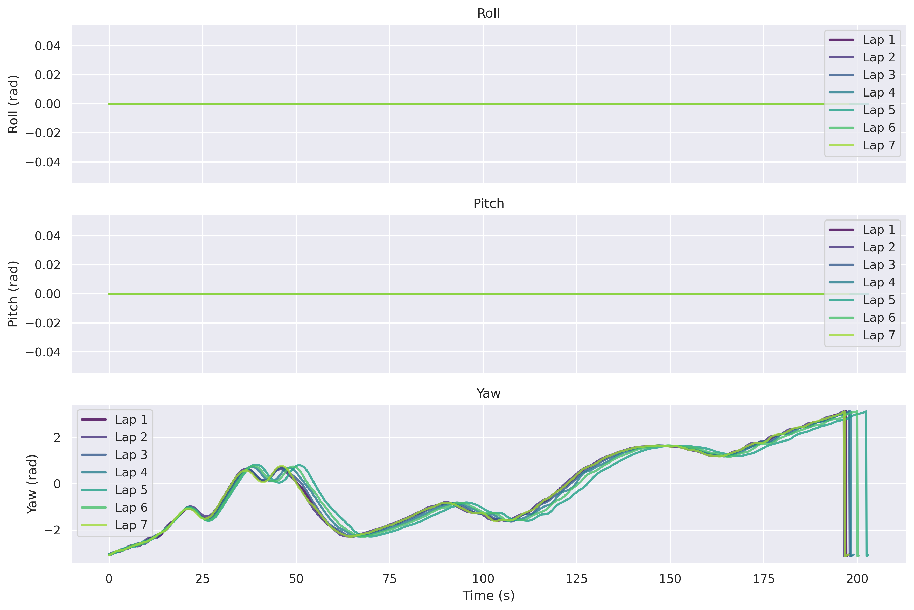

# Example Results

Real-world performance results from Race Monitor experiments.

## Table of Contents
- [Overview](#overview)
- [Experiment Details](#experiment-details)
- [Performance Summary](#performance-summary)
- [Lap Analysis](#lap-analysis)
- [Trajectory Metrics](#trajectory-metrics)
- [Visualizations](#visualizations)
- [Data Files](#data-files)
- [Interpretation](#interpretation)

---

## Overview

This document showcases actual results from a Race Monitor experiment using an LQR controller. All data, graphs, and metrics shown here are real outputs from the system, demonstrating the comprehensive analysis capabilities of Race Monitor.

### Sample Data Location

All sample data is available in:
```
resource/sample_output_data/
├── graphs/              # Visualization plots
│   ├── trajectories.png
│   ├── speeds.png
│   ├── errors.png
│   ├── xyz.png
│   ├── rpy.png
│   ├── best_lap_3d_trajectory_vectors.png
│   ├── best_lap_error_mapped_trajectory.png
│   └── Trajectory_Error_Distribution.png
├── results/             # Analysis results
│   ├── csv/
│   │   ├── race_summary.csv
│   │   ├── race_results.csv
│   │   └── race_evaluation.csv
│   └── json/
└── terminal_log.txt     # Console output
```

---

## Experiment Details

### Configuration

| Parameter | Value |
|-----------|-------|
| **Controller** | lqr_controller_node |
| **Experiment ID** | exp_011 |
| **Date** | October 25, 2025 |
| **Required Laps** | 7 |
| **Race Mode** | lap_complete |
| **Reference Trajectory** | Provided |

### System Information

- **OS**: Linux (Ubuntu)
- **ROS2**: Humble
- **Python**: 3.10+
- **Race Monitor**: v1.0.0

---

## Performance Summary

### Overall Performance

```
╔══════════════════════════════════════════╗
║         RACE PERFORMANCE SUMMARY         ║
╠══════════════════════════════════════════╣
║  Overall Grade:           B+             ║
║  Numerical Score:         75.0/100       ║
║  Race Status:             Completed      ║
║  Total Laps:              7              ║
╚══════════════════════════════════════════╝
```

### Category Grades

| Category | Grade | Description |
|----------|-------|-------------|
| **Lap Consistency** | A | Excellent lap-to-lap performance |
| **Speed Performance** | A | Strong velocity profile |
| **Control Quality** | A | Smooth control inputs |
| **Path Efficiency** | A | Efficient racing line |
| **Trajectory Quality** | F | Significant deviation from reference |

### Key Metrics

| Metric | Value |
|--------|-------|
| **Best Lap Time** | 19.53 s |
| **Average Lap Time** | 19.75 s |
| **Worst Lap Time** | 19.94 s |
| **Total Race Time** | 138.23 s |
| **Lap Time Std Dev** | 0.15 s |
| **Consistency Score** | 99.22% |

---

## Lap Analysis

### Lap Times

| Lap | Time (s) | Deviation | Speed (m/s) | Visual |
|-----|----------|-----------|-------------|--------|
| 1 | 19.670 | +0.140 | 3.40 | ████████████████████ |
| 2 | 19.729 | +0.199 | 3.39 | ████████████████████ |
| 3 | 19.940 | +0.410 | 3.35 | ████████████████████▌ |
| 4 | 19.840 | +0.310 | 3.37 | ████████████████████▌ |
| 5 | **19.530** | **Best** | **3.43** | ███████████████████▌ |
| 6 | 19.580 | +0.050 | 3.42 | ███████████████████▌ |
| 7 | 19.940 | +0.410 | 3.35 | ████████████████████▌ |

**Statistics**:
- Mean: 19.747 s
- Median: 19.729 s
- Std Dev: 0.153 s
- Range: 0.410 s (2.08%)

### Distance Analysis

| Metric | Value |
|--------|-------|
| **Total Distance** | 470.25 m |
| **Average Lap Distance** | 67.18 m |
| **Distance Std Dev** | 0.18 m |
| **Distance Consistency** | 99.73% |

### Speed Analysis

| Metric | Value |
|--------|-------|
| **Average Speed** | 3.40 m/s |
| **Best Lap Speed** | 3.44 m/s |
| **Max Speed Achieved** | 3.79 m/s |
| **Speed Consistency CV** | 5.0% |

---

## Trajectory Metrics

### Absolute Pose Error (APE)

Analysis compared to reference trajectory:

| Statistic | Translation (m) | Description |
|-----------|----------------|-------------|
| **RMSE** | 4044.42 | Root mean square error |
| **Mean** | 4044.42 | Average error |
| **Std Dev** | 0.10 | Error standard deviation |
| **Max** | 14.60 | Maximum deviation |

**Note**: High APE values suggest significant offset from reference trajectory, possibly due to different starting positions or reference frame misalignment.

### Relative Pose Error (RPE)

Local consistency analysis (1.0m delta):

| Statistic | Translation (m) | Description |
|-----------|----------------|-------------|
| **RMSE** | 4.42 | Root mean square error |
| **Mean** | 4.42 | Average drift |
| **Std Dev** | 0.0004 | Error standard deviation |
| **Max** | 0.45 | Maximum local error |

**Interpretation**: Low RPE indicates good local consistency despite global offset.

### Vehicle Dynamics

#### Velocity Statistics

| Metric | Value |
|--------|-------|
| Mean Linear Velocity | 0.342 m/s |
| Velocity Std Dev | 0.135 m/s |
| Max Velocity (Mean) | 1.073 m/s |

#### Acceleration Statistics

| Metric | Value |
|--------|-------|
| Mean Acceleration | 0.280 m/s² |
| Acceleration Std Dev | 1.240 m/s² |
| Max Acceleration | 10.73 m/s² |
| Mean Jerk | 0.533 m/s³ |

#### Angular Motion

| Metric | Value |
|--------|-------|
| Mean Angular Velocity | 0.080 rad/s |
| Mean Curvature | 0.0081 rad/m |
| Max Curvature | 0.0366 rad/m |

### Path Quality

| Metric | Value | Description |
|--------|-------|-------------|
| **Path Efficiency** | 4.67% | Closeness to optimal line |
| **Consistency CV** | 4.65% | Lap-to-lap variation |
| **Total Trajectory Points** | 13,816 | Data points collected |
| **Avg Points Per Lap** | 1,974 | Sampling density |
| **Sampling Rate** | ~10 Hz | Update frequency |

---

## Visualizations

All visualizations are available in both PNG and PDF formats in `resource/sample_output_data/graphs/`.

### 1. Trajectories Overview

**File**: `trajectories.png`

2D comparison of all lap trajectories overlaid on the map. Shows:
- Consistent racing line across laps
- Start/finish line location
- Track boundaries
- Lap-to-lap variations


### 2. Speed Profile

**File**: `speeds.png`

Velocity analysis over time showing:
- Speed variations throughout laps
- Acceleration/braking zones
- Speed consistency across laps
- Target vs actual speed


### 3. Position Components (XYZ)

**File**: `xyz.png`

3D position components over time:
- X, Y, Z coordinates separately
- Temporal evolution of position
- Height variation (if applicable)



### 4. Orientation (Roll-Pitch-Yaw)

**File**: `rpy.png`

Vehicle orientation analysis:
- Roll, pitch, yaw angles over time
- Orientation stability
- Turning behavior



### 5. Error Analysis

**File**: `errors.png`

Tracking errors compared to reference:
- APE over time
- RPE distribution
- Error peaks and valleys
- Statistical distribution


### 6. Best Lap 3D Trajectory with Vectors

**File**: `best_lap_3d_trajectory_vectors.png`

3D visualization of best lap (Lap 5) with velocity vectors:
- 3D trajectory path
- Velocity direction arrows
- Speed indicated by color
- Critical points highlighted


### 7. Error-Mapped Trajectory

**File**: `best_lap_error_mapped_trajectory.png`

Best lap trajectory with error heatmap:
- 2D trajectory path
- Color-coded by tracking error
- High error zones highlighted
- Reference trajectory comparison


### 8. Trajectory Error Distribution

**File**: `Trajectory_Error_Distribution.png`

Statistical distribution of trajectory errors:
- Histogram of errors
- Distribution statistics
- Quartile analysis
- Outlier identification


---

## Data Files

### Race Summary

Complete race overview: `results/csv/race_summary.csv`

Key sections:
- **Race Metadata**: Controller, experiment ID, timestamps
- **Lap Statistics**: Best/worst/average lap times, consistency
- **Individual Lap Times**: Per-lap breakdown
- **Trajectory Statistics**: Distance, points, efficiency
- **Performance Metrics**: Speed, distance per second

**Sample Data**:
```csv
=== RACE METADATA ===
Controller Name,lqr_controller_node
Experiment Id,exp_011
Total Race Time,138.229655552
Laps Completed,7

=== LAP STATISTICS ===
Best Lap Time,19.5305
Worst Lap Time,19.9400
Average Lap Time,19.7471
Consistency Score,0.9922
```

### Race Evaluation

Performance grading: `results/csv/race_evaluation.csv`

Includes:
- **Overall Grade**: A-F letter grade
- **Category Grades**: Individual performance aspects
- **APE/RPE Analysis**: Trajectory accuracy metrics
- **Recommendations**: Improvement suggestions

**Sample Data**:
```csv
=== PERFORMANCE SUMMARY ===
Overall Grade,B+
Numerical Score,75.0
Best Lap Time,19.530493696
Lap Consistency CV,0.7758223868361247

=== CATEGORY GRADES ===
Trajectory Quality,F
Control Quality,A
Speed Performance,A
Path Efficiency,A
Lap Consistency,A
```

### Terminal Log

Complete console output: `terminal_log.txt`

Real-time logging of:
- Race initialization
- Lap completions with times
- Event notifications
- Analysis progress
- Final summary

**Sample Excerpt**:
```
[INFO] Race started | Beginning lap 1
[INFO] Lap complete | Lap 1 in 19.670s
[INFO] Lap complete | Lap 2 in 19.729s
[INFO] Race completed!
[INFO] Total time: 138.230 s
[INFO] Best lap: 19.530 s
```

---

## Interpretation

### What the Results Tell Us

#### Strengths

1. **Excellent Consistency** (A grade)
   - Lap time variation: only 0.41s (2.08%)
   - Consistency score: 99.22%
   - Stable control throughout race

2. **Strong Speed Performance** (A grade)
   - Average speed: 3.40 m/s
   - Efficient acceleration/braking
   - Good velocity profile

3. **Smooth Control** (A grade)
   - Low jerk (0.533 m/s³)
   - Controlled acceleration
   - Stable angular motion

4. **Path Efficiency** (A grade)
   - Consistent lap distances (67.18 ± 0.18 m)
   - Efficient racing line
   - Minimal path length variation

#### Areas for Improvement

1. **Trajectory Accuracy** (F grade)
   - High APE (4044.42 m) suggests:
     - Possible reference frame misalignment
     - Different starting position
     - Scale or coordinate system mismatch
   - Despite high APE, low RPE (4.42 m) shows good local consistency

2. **Potential Optimizations**
   - Reference trajectory alignment
   - Starting position calibration
   - Coordinate frame validation

### Performance Context

- **B+ Overall**: Strong performance with room for trajectory alignment improvement
- **Best for**: Racing scenarios prioritizing consistency and speed
- **Suitable for**: Real-time autonomous racing competitions
- **Improvement focus**: Reference trajectory calibration

---

## Using Sample Data

### For Testing

```bash
# Copy sample data to test location
cp -r resource/sample_output_data data/test_controller/exp_test

# View results
cat data/test_controller/exp_test/results/csv/race_summary.csv

# Open graphs
xdg-open data/test_controller/exp_test/graphs/*.png
```

### For Comparison

Compare your results against this baseline:

```python
import pandas as pd

# Load sample summary
sample = pd.read_csv('resource/sample_output_data/results/csv/race_summary.csv')

# Load your results
yours = pd.read_csv('data/your_controller/exp_XXX/results/csv/race_summary.csv')

# Compare lap times, consistency, etc.
```

### For Development

Use as reference for:
- Expected output format
- Visualization examples
- Metric interpretations
- Performance benchmarks

---

## Next Steps

- **Run your own experiments**: [USAGE.md](USAGE.md)
- **Analyze with EVO**: [EVO_INTEGRATION.md](EVO_INTEGRATION.md)
- **Configure analysis**: [CONFIGURATION.md](CONFIGURATION.md)
- **Compare controllers**: Use data/ directory structure

---

**Questions?**
- Configuration: [CONFIGURATION.md](CONFIGURATION.md)
- Troubleshooting: [TROUBLESHOOTING.md](TROUBLESHOOTING.md)
- Issues: https://github.com/GIU-F1Tenth/race_monitor/issues
